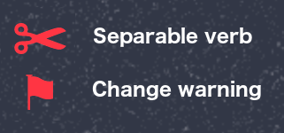
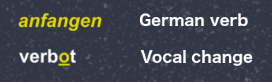

### **[GitHub Download](https://github.com/ilbrandori/Pippins-Beginners-German/tree/master/Decks) or [Ankiweb Download](https://ankiweb.net/shared/decks/Pippins)**

# Pippins Beginners German
[Pippins Beginners German](https://github.com/ilbrandori/Pippins-Beginners-Germans) is a collection of German language [Anki flashcards](https://apps.ankiweb.net/) to help you improve your German language comprehension. Use Pippins Beginners German to master beginner (A-level) and intermediate (B-level) vocabulary and ace your German language proficiency examinations.

This repo contains *source files* and *[downloadable Anki Decks](https://github.com/ilbrandori/Pippins-Beginners-German/tree/master/Decks)*.

### Pippins goal is to help you **pass** the [German B2 language examination](https://www.goethe.de/de/spr/kup/prf/prf/gb2.html).

## Anki?

If you've never heard of [Anki](https://apps.ankiweb.net/) you are in for a treat. Anki is an open source [spaced repetition system](https://en.wikipedia.org/wiki/Spaced_repetition) that allows you to memorize material faster. Think of flashcards on steroids. [Check Anki out](https://apps.ankiweb.net/) and see how other humans are using it to [better themselves](https://www.youtube.com/results?search_query=anki+learn).

## Features

* 2000+ curated (A1 to B2 level) flashcards 
* German to English / English to German flip cards with audio
* German Sentence / English Sentence with audio
* Color coding and warning icons

# Two step Cha-cha!

## (1) Pick your OS flavor and install

Anki is available for Windows, MacOS, Linux operating systems and supports both iPhone/Android devices. 
Please choose: 

- [Windows](https://apps.ankiweb.net/#windows)
- [MacOS](https://apps.ankiweb.net/#mac)
- [Linux](https://apps.ankiweb.net/#linux)
- [iPhone/Android](https://apps.ankiweb.net/#ios)

See the [How to Download Anki and Begin Using It](https://www.youtube.com/watch?v=AjdUxCnAXJw) tutorial from The AnKing Youtube channel. I highly recommend this channel to understand *how to get the most of Anki*. Also, take a moment to understand how spaced repetition works and how Anki helps you achieve this.   

## (2) Download flashcards
See the [Decks folder](https://github.com/ilbrandori/Pippins-Beginners-German/tree/master/Decks) for all available (including under development) flashcard collections. All linted, or proofread, decks are published at [Ankiweb](https://ankiweb.net/shared/decks/Pippins), use "Pippins" search keyword. 

## Contribute

**Is this high quality?** 
Kinda, but there are still ugly bugs, and typos to be uncovered. If you happen to spot one you can:

* [Submit a ticket](https://forms.gle/vbVNECZmXNG8cHuH7)
* [Open an issue](https://github.com/ilbrandori/Pippins-Beginners-German/issues)
* [Submit a pull request](https://github.com/ilbrandori/Pippins-Beginners-German/pulls)

## Icons 
Here's some icons you'll encounter using the flashcards.

## Warnings
Warnings are pretty obvious, but here's what they mean.

## Colors
Watchout for underlines!

## Authors
**Brando Rico** - *Initial seed and most of the grunt work* - 

## License
Creative Commons Zero v1.0 Universal The Creative Commons CC0 Public Domain Dedication waives copyright interest in a work you've created and dedicates it to the world-wide public domain. See the [LICENSE](https://github.com/ilbrandori/Pippins-Beginners-German/blob/master/LICENSE) file for details.

